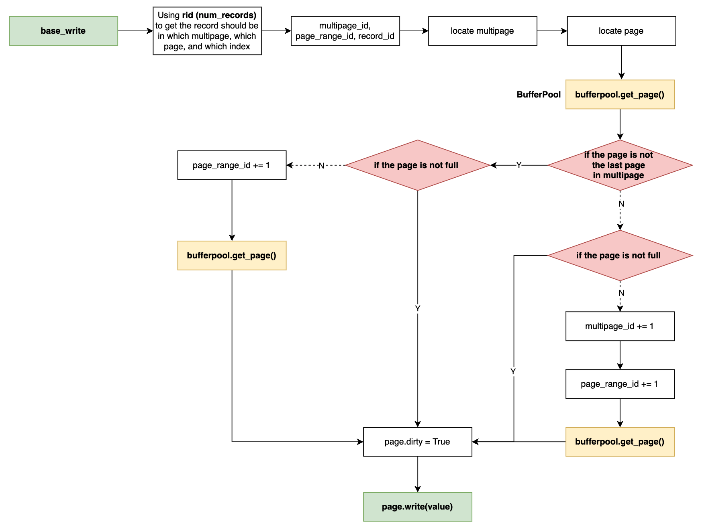
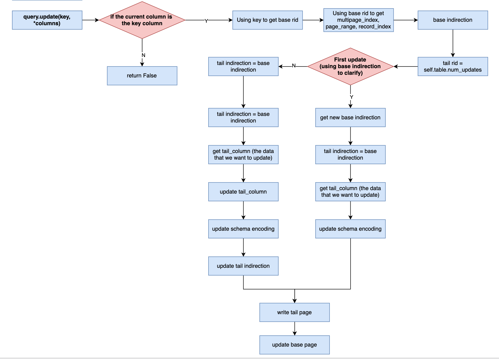
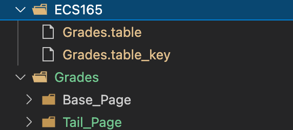
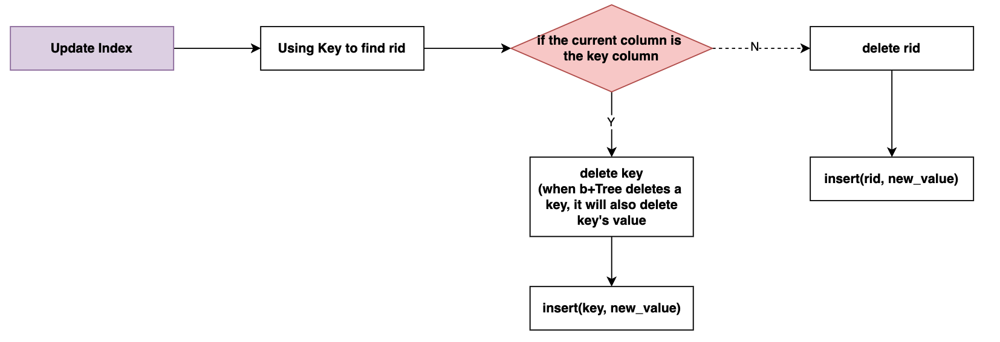

# L-Store Illustration 
- [L-Store Illustration](#l-store-illustration)
  - [First Layer - `db.py`](#first-layer---dbpy)
    - [Example](#example)
  - [Query - `query.insert(*columns)`](#query---queryinsertcolumns)
    - [Base_write](#base_write)
    - [Index & Update Index](#index--update-index)
  - [Query - `query.update(self, primary_key, *columns)`](#query---queryupdateself-primary_key-columns)
    - [Tail_write](#tail_write)
    - [Update Index](#update-index)
  - [Query - `query.select(self, primary_key, column, query_columns)`](#query---queryselectself-primary_key-column-query_columns)
  - [Query - `query.sum(self, start_range, end_range, aggregate_column_index)`](#query---querysumself-start_range-end_range-aggregate_column_index)
  - [BufferPool](#bufferpool)
  - [Merge](#merge)

## First Layer - `db.py`


### Example
```python
db = Database()
db.open('./ECS165')
grades_table = db.create_table('Grades', 5, 0)
db.close()
```

<center>
</center>

* `Grades.table`: the `Table()` object in serialization
* `Grades.table_key`: a list contained primary keys from that table in serialization

## Query - `query.insert(*columns)`

<center>


</center>

### Base_write

Suppose we inserted a key `[92106430, 1, 14, 1, 19]` in our `Grades` table (5 columns; the first column is the primary key column):

* By using the loop, each value in that record will be inserted one by one:



* In the `page.write(value)`, we convert value in to bytes for storing in the disk.
  * Example: insert `[92106430, 1, 14, 1, 19]`. To check if it successfully converted values into bytes:

```python
for i in range(4, 9):
    print(grades_table.page_directory['base'][i][0].pages[0].get(0))
    print(int.from_bytes(grades_table.page_directory['base'][i][0].pages[0].get(0), byteorder='big'))
```
* The output will be:
```python
bytearray(b'\x00\x00\x00\x00\x05}n\xbe')
92106430
bytearray(b'\x00\x00\x00\x00\x00\x00\x00\x01')
1
bytearray(b'\x00\x00\x00\x00\x00\x00\x00\x0e')
14
bytearray(b'\x00\x00\x00\x00\x00\x00\x00\x01')
1
bytearray(b'\x00\x00\x00\x00\x00\x00\x00\x13')
19
```

* `bufferpool.get_page()`: this function makes page file in the disk (more details in the later section). It also allows reading data from disk (before closing the BufferPool, it will not have any data in the file but only a filename).

**Suppose we only insert records:**
* The size of BufferPool is `1000`, the basic unit it `Page()`. When inserting values, we will insert a column or a `Page()` as a basic unit in the BufferPool.
* When inserting a record in table, the BufferPool will be shown as:
```python
('Grades', 0, 0, 0, 'Base_Page')
<lstore.page.Page object at 0x10557f520>
('Grades', 1, 0, 0, 'Base_Page')
<lstore.page.Page object at 0x10557f550>
('Grades', 2, 0, 0, 'Base_Page')
<lstore.page.Page object at 0x10557f040>
('Grades', 3, 0, 0, 'Base_Page')
<lstore.page.Page object at 0x10557efe0>
('Grades', 4, 0, 0, 'Base_Page')
<lstore.page.Page object at 0x10557ed10>
('Grades', 5, 0, 0, 'Base_Page')
<lstore.page.Page object at 0x10557f790>
('Grades', 6, 0, 0, 'Base_Page')
<lstore.page.Page object at 0x10557f7f0>
('Grades', 7, 0, 0, 'Base_Page')
<lstore.page.Page object at 0x10557f850>
('Grades', 8, 0, 0, 'Base_Page')
<lstore.page.Page object at 0x10557f8b0>
```

By using BufferPool, we can quickly `query.select` a record in the BufferPool.

### Index & Update Index


```python
#Update Index
for i, val in enumerate(column):
    if i == self.table.key : #in the first column, key = primary key, value = rid
        self.table.index.create_index(i, val, rid)
    else: 
        self.table.index.create_index(i, rid, val)
```

---
## Query - `query.update(self, primary_key, *columns)`



### Tail_write

when we update records, we will also insert tail pages in BufferPool:
```python
('Grades', 0, 0, 0, 'Base_Page')
<lstore.page.Page object at 0x1208cad70>
('Grades', 1, 0, 0, 'Base_Page')
<lstore.page.Page object at 0x1208cadd0>
('Grades', 2, 0, 0, 'Base_Page')
<lstore.page.Page object at 0x1208cae60>
('Grades', 3, 0, 0, 'Base_Page')
<lstore.page.Page object at 0x1208ca8c0>
('Grades', 4, 0, 0, 'Base_Page')
<lstore.page.Page object at 0x1208ca860>
('Grades', 5, 0, 0, 'Base_Page')
<lstore.page.Page object at 0x1208cafe0>
('Grades', 6, 0, 0, 'Base_Page')
<lstore.page.Page object at 0x1208cb040>
('Grades', 7, 0, 0, 'Base_Page')
<lstore.page.Page object at 0x1208cb0a0>
('Grades', 8, 0, 0, 'Base_Page')
<lstore.page.Page object at 0x1208cb100>
('Grades', 0, 0, 'Tail_Page')
<lstore.page.Page object at 0x1208cb340>
('Grades', 1, 0, 'Tail_Page')
<lstore.page.Page object at 0x1208cb3d0>
('Grades', 2, 0, 'Tail_Page')
<lstore.page.Page object at 0x1208cb370>
('Grades', 3, 0, 'Tail_Page')
<lstore.page.Page object at 0x1208cb460>
('Grades', 4, 0, 'Tail_Page')
<lstore.page.Page object at 0x1208cb4c0>
('Grades', 5, 0, 'Tail_Page')
<lstore.page.Page object at 0x1208caf20>
('Grades', 6, 0, 'Tail_Page')
<lstore.page.Page object at 0x1208cb520>
('Grades', 7, 0, 'Tail_Page')
<lstore.page.Page object at 0x1208cb550>
('Grades', 8, 0, 'Tail_Page')
<lstore.page.Page object at 0x1208cb640>
```

<center>
</center>

### Update Index


```python
for col, value in enumerate(columns):
    if value == None:
        continue
    else:
        self.table.index.update_index(primary_key, col, value)
```
```python
def update_index(self, key, column_number, new_value):
        rid = self.locate(self.table.key, key)[0]
        if column_number == self.table.key:
            tree = self.indices[self.table.key]
            tree.delete(key)
            tree.insert(new_value, rid)
        else:
            tree = self.indices[column_number]
            tree.delete(rid)
            tree.insert(rid, new_value)
```


**Update example:**
Suppose we want to insert 2 record and update 3 times each of record:

* Before update:
    ```python
    [18446744073709551615, 0, 1646595348, 0, 92106430, 1, 14, 1, 19]
    [18446744073709551615, 1, 1646595348, 0, 92106429, 13, 2, 10, 10]
    ```
* Updates:
    ```python
    1 update on [92106430, 1, 14, 1, 19] and [None, None, 8, None, None] : [92106430, 1, 8, 1, 19]
    2 update on [92106430, 1, 8, 1, 19] and [None, None, 8, 2, None] : [92106430, 1, 8, 2, 19]
    3 update on [92106430, 1, 8, 2, 19] and [None, None, 8, 2, 4] : [92106430, 1, 8, 2, 4]
    4 update on [92106429, 13, 2, 10, 10] and [None, None, 1, None, None] : [92106429, 13, 1, 10, 10]
    5 update on [92106429, 13, 1, 10, 10] and [None, None, 1, 18, None] : [92106429, 13, 1, 18, 10]
    6 update on [92106429, 13, 1, 18, 10] and [None, None, 1, 18, 20] : [92106429, 13, 1, 18, 20]
    ```
* After update:
  * Tail page:
    ```python
    # first primary key
    [18446744073709551614, 0, 1646595348, 4, 0, 0, 8, 0, 0]
    [18446744073709551612, 1, 1646595348, 12, 0, 0, 8, 2, 0]
    [18446744073709551609, 2, 1646595348, 28, 0, 0, 8, 2, 4]
    # second primary key
    [18446744073709551610, 3, 1646595348, 4, 0, 0, 1, 0, 0]
    [18446744073709551604, 4, 1646595348, 12, 0, 0, 1, 18, 0]
    [18446744073709551597, 5, 1646595348, 28, 0, 0, 1, 18, 20]
    ```

```python
Original record:
[18446744073709551609, 0, 1646595348, 28, 92106430, 1, 14, 1, 19]
tail_record:
[18446744073709551609, 2, 1646595348, 28, 0, 0, 8, 2, 4]
select key to check:
[92106430, 1, 8, 2, 4]


Original record:
[18446744073709551597, 1, 1646595348, 28, 92106429, 13, 2, 10, 10]
tail_record:
[18446744073709551597, 5, 1646595348, 28, 0, 0, 1, 18, 20]
select key to check:
[92106429, 13, 1, 18, 20]
```

## Query - `query.select(self, primary_key, column, query_columns)`


<center>
</center>


---
## Query - `query.sum(self, start_range, end_range, aggregate_column_index)`

```python
def locate_range(self, begin, end, column=None): #primary key - rids - values
        rids = []
        key_lst = sorted(self.table.key_lst)
        for key in key_lst:
            if key > end:
                break
            else:
                if key in range(begin, end + 1):
                    if column == self.table.key:
                        rids.append(key)
                    else:
                        rid = self.locate(self.table.key, key)[0]
                        rids.append(rid)
        return rids
```

```python
def sum(self, start_range, end_range, aggregate_column_index):
        sum = 0
        if aggregate_column_index == self.table.key:
            rids = self.table.index.locate_range(start_range, end_range, self.table.key)
            for rid in rids:
                sum += rid
        else:
            rids = self.table.index.locate_range(start_range, end_range)
            for rid in rids:
                value = self.table.index.locate(aggregate_column_index, rid)[0]
                sum += value
        
        return sum
```

---
## BufferPool

## Merge
