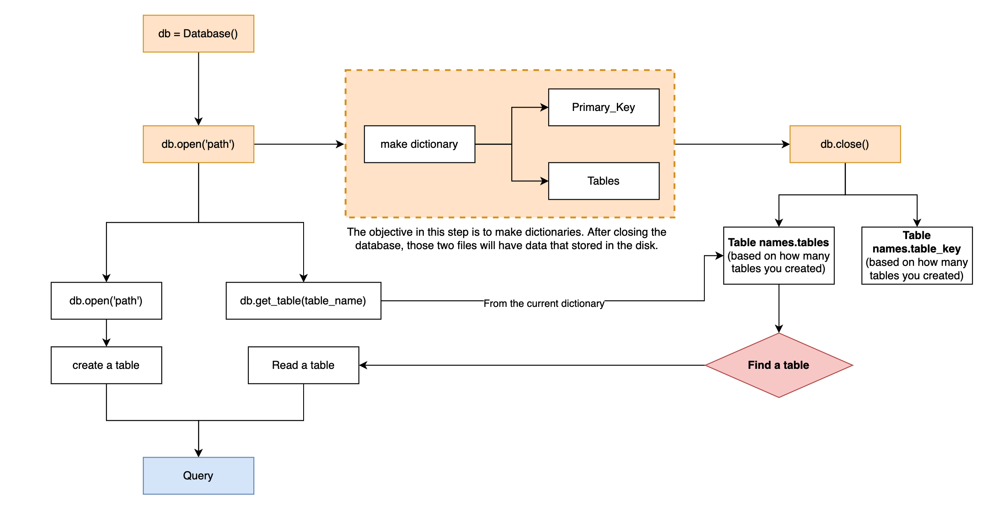
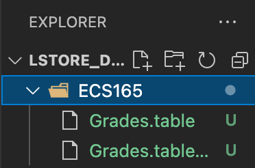
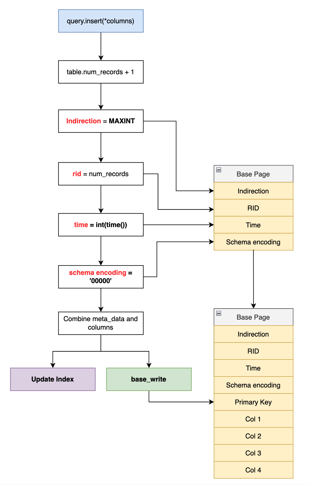
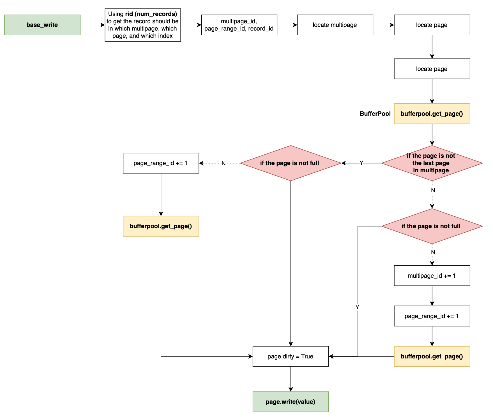
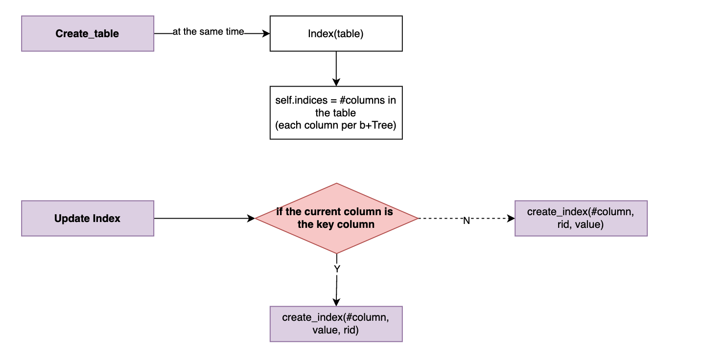
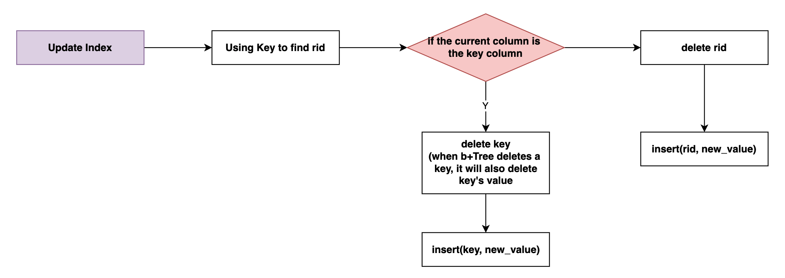
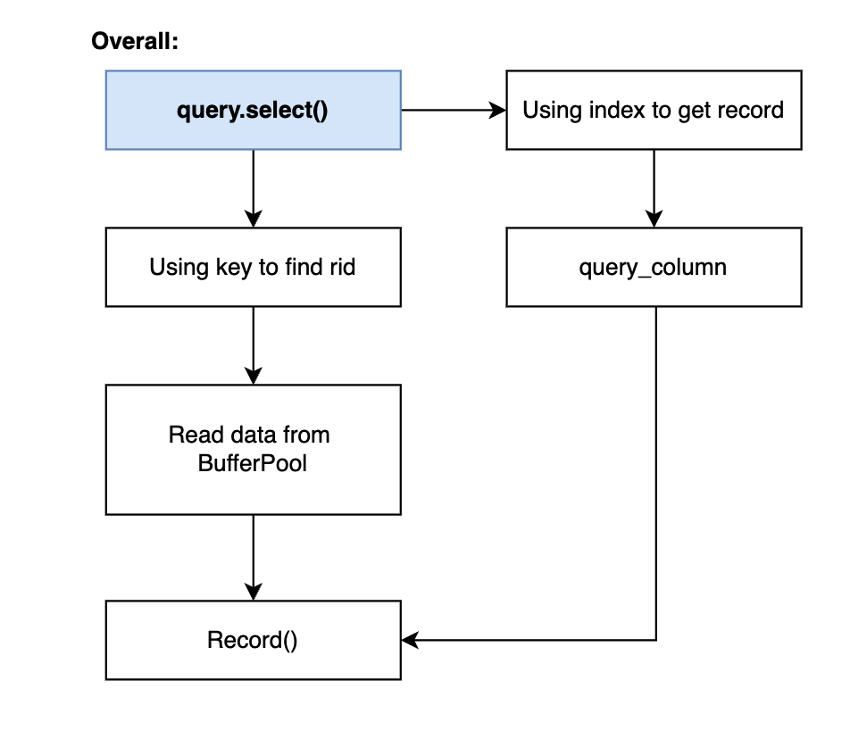
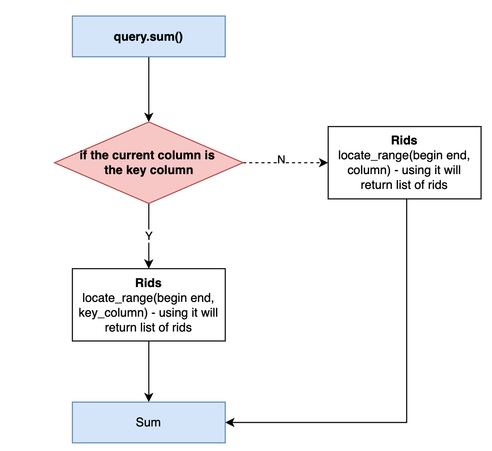

# L-Store Illustration 
- [L-Store Illustration](#l-store-illustration)
  - [First Layer - `db.py`](#first-layer---dbpy)
    - [Example](#example)
  - [Query - `query.insert(*columns)`](#query---queryinsertcolumns)
    - [Base_write](#base_write)
    - [Index & Update Index](#index--update-index)
  - [Query - `query.update(self, primary_key, *columns)`](#query---queryupdateself-primary_key-columns)
    - [Tail_write](#tail_write)
    - [Update Index](#update-index)
  - [Query - `query.select(self, primary_key, column, query_columns)`](#query---queryselectself-primary_key-column-query_columns)
    - [Read from BufferPool](#read-from-bufferpool)
    - [Read from Index](#read-from-index)
  - [Query - `query.sum(self, start_range, end_range, aggregate_column_index)`](#query---querysumself-start_range-end_range-aggregate_column_index)

## First Layer - `db.py`



### Example
```python
db = Database()
db.open('./ECS165')
grades_table = db.create_table('Grades', 5, 0)
db.close()
```

<center>
</center>

* `Grades.table`: the `Table()` object in serialization
* `Grades.table_key`: a list contained primary keys from that able in serialization

## Query - `query.insert(*columns)`

<center>
</center>

### Base_write

Suppose we inserted a key `[92106430, 1, 14, 1, 19]` in our `Grades` table (5 columns; the first column is the primary key column):

* By using the loop, each value in that record will be inserted one by one:



* In the `page.write(value)`, we convert value in to bytes for storing in the disk.
  * Example: insert `[92106430, 1, 14, 1, 19]`. To check if it successfully converted values into bytes:

```python
for i in range(4, 9):
    print(grades_table.page_directory['base'][i][0].pages[0].get(0))
    print(int.from_bytes(grades_table.page_directory['base'][i][0].pages[0].get(0), byteorder='big'))
```
* The output will be:
```python
bytearray(b'\x00\x00\x00\x00\x05}n\xbe')
92106430
bytearray(b'\x00\x00\x00\x00\x00\x00\x00\x01')
1
bytearray(b'\x00\x00\x00\x00\x00\x00\x00\x0e')
14
bytearray(b'\x00\x00\x00\x00\x00\x00\x00\x01')
1
bytearray(b'\x00\x00\x00\x00\x00\x00\x00\x13')
19
```

* `bufferpool.get_page()`: this make page file in the disk (more details in the later section). This allow we can read data from disk (before closing the BufferPool, it will not have any data in the file but only a filename).

**Suppose we are only inserting the data:**
* The size of BufferPool is `1000`, the basic unit it `Page()`. When inserting values, we will insert a column or a `Page()` as a basic unit in the BufferPool.
* When inserting a record in table, the BufferPool will be shown as:
```python
('Grades', 0, 0, 0, 'Base_Page')
<lstore.page.Page object at 0x10557f520>
('Grades', 1, 0, 0, 'Base_Page')
<lstore.page.Page object at 0x10557f550>
('Grades', 2, 0, 0, 'Base_Page')
<lstore.page.Page object at 0x10557f040>
('Grades', 3, 0, 0, 'Base_Page')
<lstore.page.Page object at 0x10557efe0>
('Grades', 4, 0, 0, 'Base_Page')
<lstore.page.Page object at 0x10557ed10>
('Grades', 5, 0, 0, 'Base_Page')
<lstore.page.Page object at 0x10557f790>
('Grades', 6, 0, 0, 'Base_Page')
<lstore.page.Page object at 0x10557f7f0>
('Grades', 7, 0, 0, 'Base_Page')
<lstore.page.Page object at 0x10557f850>
('Grades', 8, 0, 0, 'Base_Page')
<lstore.page.Page object at 0x10557f8b0>
```

By using BufferPool, we can quickly `query.select` a record in the BufferPool.

### Index & Update Index



```python
#Update Index
for i, val in enumerate(column):
    if i == self.table.key : #in the first column, key = primary key, value = rid
        self.table.index.create_index(i, val, rid)
    else: 
        self.table.index.create_index(i, rid, val)
```

## Query - `query.update(self, primary_key, *columns)`

### Tail_write

### Update Index


```python
for col, value in enumerate(columns):
    if value == None:
        continue
    else:
        self.table.index.update_index(primary_key, col, value)
```
```python
def update_index(self, key, column_number, new_value):
        rid = self.locate(self.table.key, key)[0]
        if column_number == self.table.key:
            tree = self.indices[self.table.key]
            tree.delete(key)
            tree.insert(new_value, rid)
        else:
            tree = self.indices[column_number]
            tree.delete(rid)
            tree.insert(rid, new_value)
```

## Query - `query.select(self, primary_key, column, query_columns)`


<center>
</center>

### Read from BufferPool

### Read from Index

## Query - `query.sum(self, start_range, end_range, aggregate_column_index)`

<center>
</center>

```python
def locate_range(self, begin, end, column=None): #primary key - rids - values
        rids = []
        key_lst = sorted(self.table.key_lst)
        for key in key_lst:
            if key > end:
                break
            else:
                if key in range(begin, end + 1):
                    if column == self.table.key:
                        rids.append(key)
                    else:
                        rid = self.locate(self.table.key, key)[0]
                        rids.append(rid)
        return rids
```

```python
def sum(self, start_range, end_range, aggregate_column_index):
        sum = 0
        if aggregate_column_index == self.table.key:
            rids = self.table.index.locate_range(start_range, end_range, self.table.key)
            for rid in rids:
                sum += rid
        else:
            rids = self.table.index.locate_range(start_range, end_range)
            for rid in rids:
                value = self.table.index.locate(aggregate_column_index, rid)[0]
                sum += value
        
        return sum
```