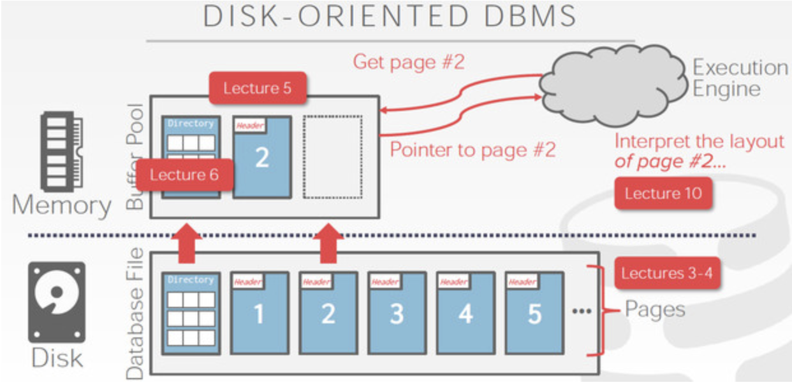
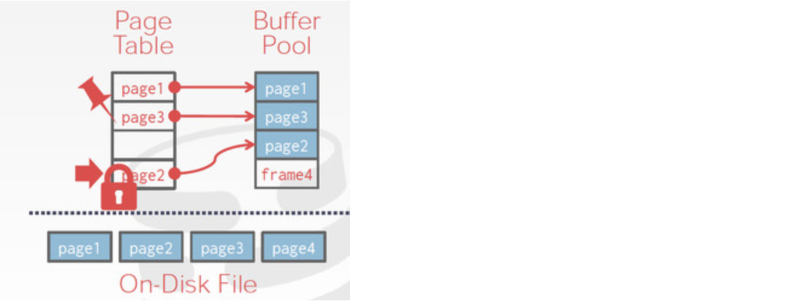
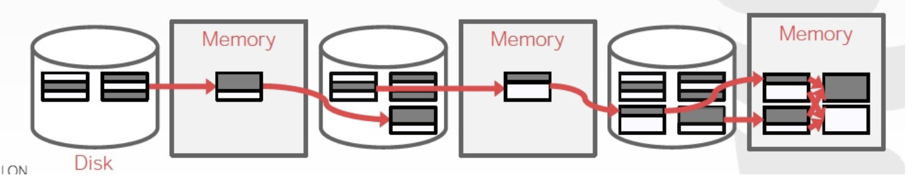

# ECS 165A: L-Store

## Team members & Contributors
- **Zihao Huang** (Developer, Tester, System Architect)
- **Qian Yao** (Developer, Tester, System Architect)
- **Justin Wallasch** (Developer, Tester)
- **Shuying Li** (Developer, Team Coordinator)

## Instructors
**Professor**: [Mohammad Sadoghi](https://expolab.org/)

**Teaching Fellow**: Sajjad Rahnama

**Teaching Fellow**: Shesha Vishnu Prasad

# Contents 
- [ECS 165A: L-Store](#ecs-165a-l-store)
  - [Team members & Contributors](#team-members--contributors)
  - [Instructors](#instructors)
- [Contents](#contents)
  - [L-Store Fundamentals](#l-store-fundamentals)
    - [Introduction](#introduction)
    - [Date Model](#date-model)
      - [Tree Indexes](#tree-indexes)
    - [Bufferpool Management](#bufferpool-management)
      - [Basics](#basics)
      - [Disk-Oriented DMBS](#disk-oriented-dmbs)
      - [Meta-data](#meta-data)
      - [BufferPool](#bufferpool)
    - [Query_Interface](#query_interface)
  - [Milestones](#milestones)
    - [Milestone 1](#milestone-1)
      - [Reconstruction Overview](#reconstruction-overview)
      - [Presentation](#presentation)
    - [Milestone 2](#milestone-2)
      - [Restructure Details](#restructure-details)
      - [Presentation](#presentation-1)
    - [Milestone 3](#milestone-3)
      - [Presentation](#presentation-2)
  - [Sources](#sources)

## L-Store Fundamentals
### Introduction
Lineage-based Data Store (**L-Store**) is a solution that combines the real-time processing of transactional and analytical workloads within a single unified engine by introducing a novel update-friendly lineage-based storage architecture.

### Date Model
* Data storage in L-Store is columnar. The key idea is to separate the original version of a record inserted into the database (**base record**) and the subsequent updates to it (**tail records**)

#### Tree Indexes


---
### Bufferpool Management

#### Basics
* **Volatile: faster and smaller**
* **Non-volatile: slower and larger**
* A **page** is a fixed-size block of data:
  * It can contain tuples, meta-data, indexes, log records..
  * Most systems do not mix page types.
  * Some systems require a page to be self-contained
  * **Each page is given a unique identifier:**
    * ==The DBMS uses an indirection layer to map page ids to physical locations.==
  * There are three different notions of "pages" in a DBMS:
    * Hardware Page (usually 4 KB)
    * OS Page (usually 4 KB)
    * Database Page (1-16 KB)
  * **Different DBMSs manage pages in files on disk in different ways:**
    * Heap file Organization:
      * A **heap file** is an unordered collection of pages where tuples that are stored in random order.
        * Get / Delete Page
        * Must also support iterating over all pages
      * **Two ways to represent a heap file:**
        * Linked list
        * ==Page Directory (we use this in L-Store)==
    * Sequential / Sorted File Organization
    * Hashing File Organization
* Need meta-data to keep track of what pages exist and which ones have free space.
* **Page Directory:**
  * The DBMS maintains special pages that tracks the location of data data pages in the database files.
  * The directory also records the number of free slots per page.
  * The DBMS has to make sure that the directory pages are in sync with the data pages.

<center>
</center>

#### Disk-Oriented DMBS


#### Meta-data
How meta-data store?
* A DBMS stores meta-data about databases in its internal catalogs:
  * Tables, columns, indexes, views
  * Users, permissions
  * Internal statistics

#### BufferPool
* The page table keeps track of pages that are currently in memory
* Maintains additional meta-data per page:
  * Dirty Flag
  * Pin/Reference Counter



**Merge:**
* **Pass #0:**
  * Reads every B pages of the table into memory
  * Sorts them, and writes them back to disk
  * Each sorted set of pages is called run.
* **Pass #1,2,3,...**
  * Recursively merges pairs of runs into runs twice as long
  * Uses buffer pages



---
### Query_Interface

---
## Milestones
### Milestone 1
**Objectives**: Single-threaded, In-memory L-Store
* we focused on a simplified in-memory (volatile) implementation that provides basic relational data storage and querying capabilities.

```python
"""
Global Setting:

* Page size: 4096 kb 
* Maximum records per page: 4096 / 8 = 512
* Maximum page per Multipage: 16 pages
* Maximum records per Multipage: 512 * 16 records
* MAXINT： maximum numbers in 8 bytes can be stored

Meta_data (Default Column):
0: Indirection (MAXINT; using the constant MAXINT to dectect if there is any updates in that records)
1: RID: numbers of records
2: Time: current time
3: Schema Encoding: if there is no updates, the column will be '1' (example, "00000", with update in column 3 will be "00100")

"""
```

```python
"""
Data Model in Milestone 1:

Page Directory {}
|_______________Base Pages[[Multipage 1], [Multipage 2]], Tail Pages[[Page 1], [Page 2]]

Table
|
Page()
|______Multipages (16 * [Page()]); multipage.pages = [Page 1, Page 2, Page 3, Page 4]
"""
```

```Python
"""
Query workflow:

Insert:
* 
"""
```

**Project Description**: [Milestone 1](https://expolab.org/ecs165a-winter2022/milestones/Milestone1.pdf)

#### Reconstruction Overview
* Applying Index in data structure


#### Presentation
[Milestone 1: Single-threaded, In-memory L-Store](https://docs.google.com/presentation/d/1xfVZv24Y0t1clj_643fu7V2vQSKsAg_whh3AqZNLI50/edit?usp=sharing)

---
### Milestone 2

```python
"""
# Hierarchical Data Organization

Fields
|
Records
|
Payloads
|
Pages
|
Binary data
|
Storage

# Workflow in Data Organization in L-Store in Milestone 2
Open Database open() - Table - New B-Tree() - BufferPool Frame - Physical Pages 

"""
```

**Objectives**: Single-threaded, In-memory & Durable L-Store
* we focused on data durability by persisting data on a disk (non-volatile) and merging the base and tail data.
* In the Milestone 2, **we’re going to persist records by saving the entire database to a file.** We already set ourselves up to do that by serializing rows into page-sized memory blocks.
* **Bufferpool**: a fixed constant number of pages in your bufferpool, which is defined when we create and initialize the database (i.e., invoking the open() database function).
  * When a user requests a record that falls on a page **not currently in the bufferpool**, you need to bring the requested page first into the bufferpool. 
  * If the bufferpool is full, then you need to evict a page from your pool to allow reading the new page. 
  * If the page being evicted is dirty, then it must be written back to disk before discarding it. You may use any replacement policies of your choice, for example, Least-recently-used (LRU) or most-recently-used (MRU).
  * The bufferpool holds both base and tail pages
* **Dirty Pages**: When a page is updated in the bufferpool, it will deviate from the copy on disk, thus, the page is marked as dirty by the writer transaction. Your bufferpool needs to keep track of all the dirty pages in order to flush them back to disk upon replacement or when the database is closed (i.e., invoking the close() database function).
* **(Un)Pining Pages:** Anytime, a page in the bufferpool is accessed, the page will be pinned first, and once the transaction no longer needs the page, it will unpin it. 
  * The pin/unpin simply allows the bufferpool to track how many outstanding transactions are still accessing the page. 
  * A page can only be replaced if it has a pin value of zero implying it is not currently needed by any active transactions.
* **the database has open() and close() functions**


**Apply Indexes in L-Store:**
* B Tree

#### Restructure Details


#### Presentation

---
### Milestone 3
**Objectives**: Multi-threaded, In-memory & Durable L-Store
* We focused on concurrency and multi-threaded transaction processing.

#### Presentation


---
## Sources
1. [ECS 165A: Database Systems - Winter 2022](https://expolab.org/ecs165a-winter2022.html)
2. [Reference: Code Skeleton](https://github.com/msadoghi/165a-winter-2022)
3. [L-Store Paper](https://www.researchgate.net/publication/324150481_L-Store_A_Real-time_OLTP_and_OLAP_System)
4. [L-Store Sliders](https://expolab.org/papers/l-store-slides.pdf)